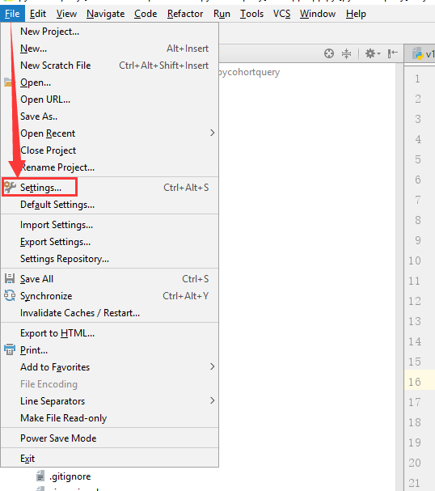
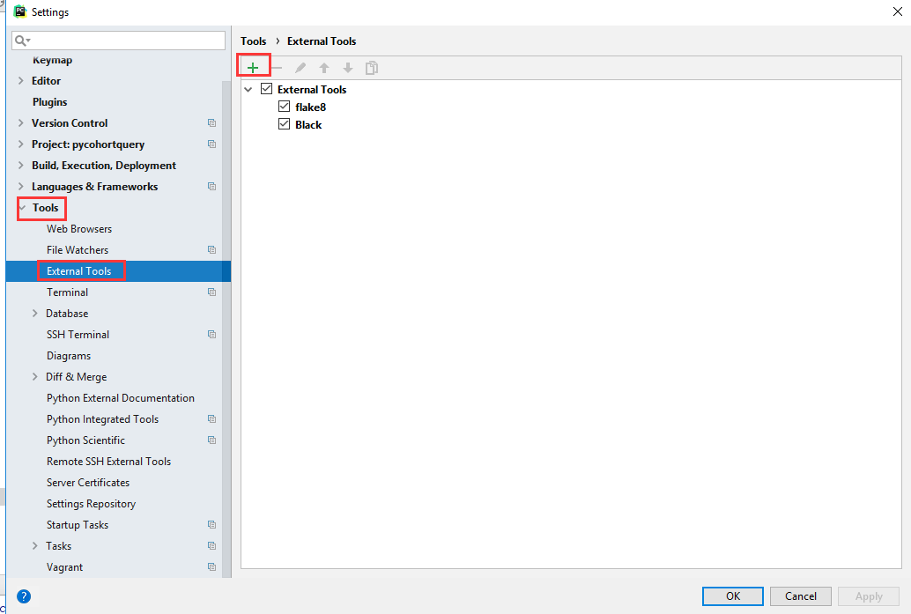
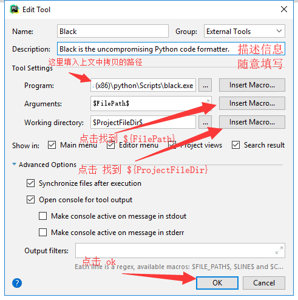
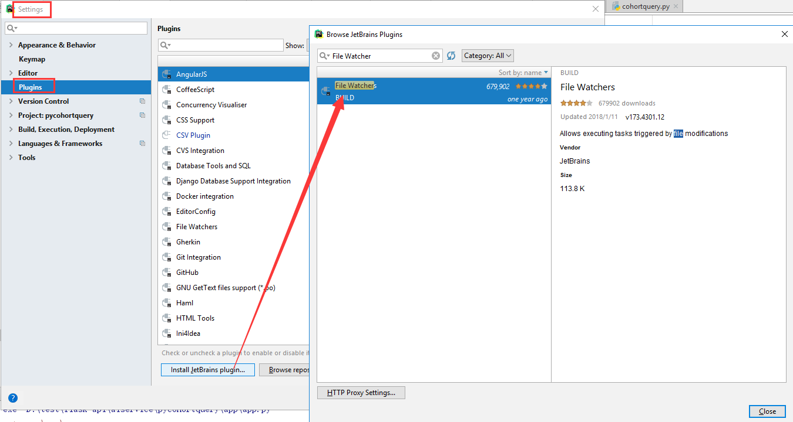

## python 代码格式化工具 black 安装 简单说明文档
1. win + r 使用  pip install black -i http://pypi.douban.com/simple --trusted-host pypi.douban.com
   

2. 输入 where black  敲回车后，拷贝 black 路径 

   

3. 打开 pycharm 找到左上角 File-->Settings --> Tools --> External Tools 点击右侧的 加号
  

  

  

4. 最好确保 PyCharm 中安装了 File Watcher 插件， 如果没有就如下图 搜索安装即可
  